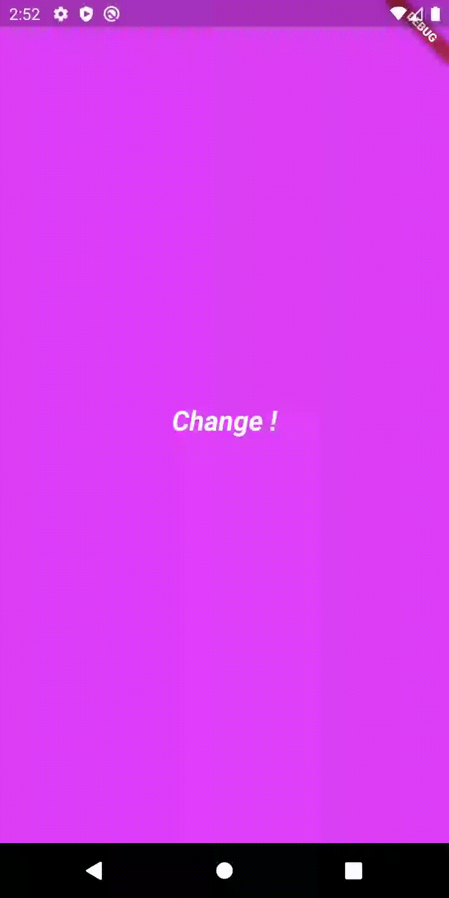

# Flutter Color changing mobile app
Color changing app is cross platform mobile application which is developed using flutter framework. Flutter is a framework which is new and very popular for developing cross platform mobile applications. This is very simple application and if you are new to flutter you can able to understand the code of this app. Those who holds good experience , this app is very simple for them.

**Steps to download and run this application**

 1. Download or clone this code to your local system.
 2. Download the visual studio code and install flutter plugin into that.
 3. Install and configure the flutter in your system.
 4. Install android studio and run AVD tool , create one emulator with default settings.
 5. Run your android emulator.
 6. Open this project with visual studio code and go to run-> run without debugging.
 7. Now your application will start on android studio emulator.

**Demo**

